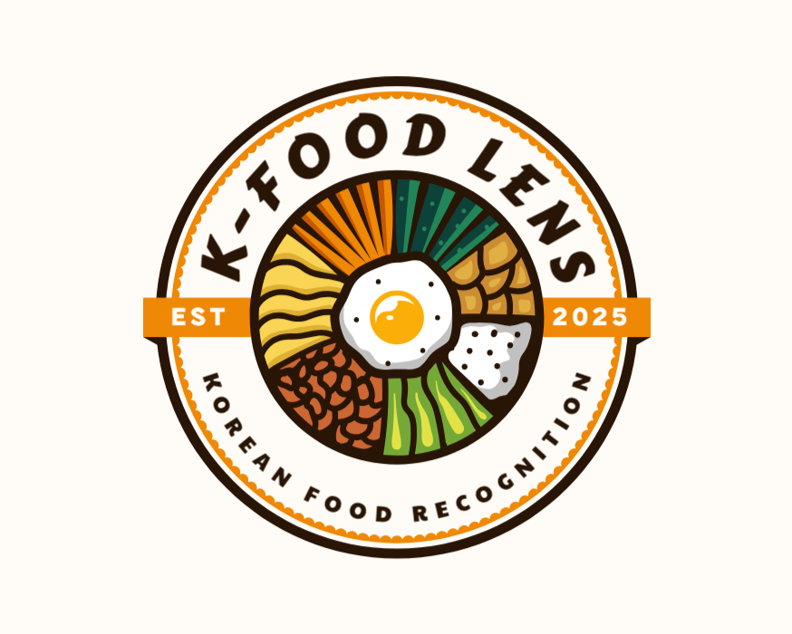

# K-FOOD LENS



**K-FOOD LENS**는 딥러닝 기반 외국인 여행객을 위한 한국 음식 인식 및 정보 제공 시스템입니다. 사진 한 장으로 한국 음식을 인식하고, 알레르기 정보, 채식 여부 등 중요한 식이 정보를 즉시 확인할 수 있습니다.

## 🌟 주요 기능

- **🍜 한국 음식 인식**: 25종 이상의 대표 한국 음식을 90% 이상의 정확도로 자동 인식
- **⚠️ 알레르기 정보 제공**: 글루텐, 대두, 유제품, 견과류 등 주요 알레르기 원인 성분 표시
- **🥗 채식 여부 확인**: 완전채식/부분채식/비채식 분류 시스템
- **📝 메뉴판 번역**: 한글 메뉴판 텍스트 인식 및 영어 번역 제공
- **📱 모바일 최적화**: 모든 기기에서 사용 가능한 반응형 웹 인터페이스

## 🚀 기술 스택

| 영역 | 기술 |
|------|------|
| AI 모델 | YOLOv8-nano, YOLOv8-medium, YOLOv8-large (앙상블) |
| OCR | EasyOCR |
| 백엔드 | Flask, Python 3.9 |
| 데이터베이스 | MongoDB |
| 프론트엔드 | HTML, CSS, JavaScript, Bootstrap |
| 배포 | Google Cloud Platform (Cloud Run) |
| 기타 | OpenCV, Numpy, Deep-Translator |

## 📋 시스템 요구사항

- Python 3.8 이상
- MongoDB
- 최소 4GB RAM (8GB 이상 권장)
- CUDA 지원 GPU (옵션)

## 🔧 설치 및 실행 방법

### 1. 저장소 클론

```bash
git clone https://github.com/yourusername/kfood-lens.git
cd kfood-lens
```

### 2. 가상환경 설정 및 의존성 설치

```bash
python -m venv venv
source venv/bin/activate  # Windows: venv\Scripts\activate
pip install -r requirements.txt
```

### 3. 환경 변수 설정

`.env` 파일을 생성하고 다음 변수를 설정합니다:

```
FLASK_ENV=development
MONGO_URI=mongodb://localhost:27017/
MONGO_DB=kfood_lens_db
SECRET_KEY=your_secret_key
```

### 4. 모델 다운로드

```bash
mkdir -p models
# YOLOv8 모델 다운로드 (자동으로 다운로드됩니다)
# 또는 수동으로 다운로드하여 models/ 디렉토리에 저장할 수 있습니다
```

### 5. 애플리케이션 실행

```bash
flask run
# 또는
python app.py
```

이제 웹 브라우저에서 `http://localhost:5000`으로 접속하여 애플리케이션을 사용할 수 있습니다.

## 📁 프로젝트 구조

```
kfood-lens/
├── app.py                 # 메인 애플리케이션 진입점
├── config.py              # 설정 파일
├── requirements.txt       # 의존성 목록
├── celery_config.py       # Celery 작업 큐 설정
├── data/                  # 데이터 파일
│   └── food_metadata_extended.json    # 음식 정보 메타데이터
├── models/                # 모델 파일 저장소
├── modules/               # 기능별 모듈
│   ├── database.py        # 데이터베이스 연결 및 쿼리
│   ├── vision.py          # 컴퓨터 비전 기능
│   ├── ocr.py             # OCR 처리
│   ├── translator.py      # 번역 기능
│   └── ...
├── routes/                # 라우트 핸들러
│   ├── main.py            # 메인 페이지
│   ├── menu.py            # 메뉴 번역
│   ├── history.py         # 기록 조회
│   └── ...
├── static/                # 정적 파일
│   ├── css/               # 스타일시트
│   ├── js/                # JavaScript
│   ├── images/            # 이미지 에셋
│   └── uploads/           # 업로드된 이미지
└── templates/             # HTML 템플릿
    ├── index.html         # 메인 페이지
    ├── menu_translate.html  # 메뉴 번역 페이지
    └── ...
```

## 📊 성능 지표

| 모델 | mAP (Mean Average Precision) | 추론 속도 |
|------|------------------------------|-----------|
| YOLOv8-nano | 0.89 | 15ms/이미지 |
| YOLOv8-medium | 0.92 | 25ms/이미지 |
| YOLOv8-large | 0.94 | 40ms/이미지 |
| 앙상블 모델 | 0.93 | 50ms/이미지 |

## 🔍 지원되는 음식 목록

현재 아래 25종의 한국 음식을 인식할 수 있습니다:

1. 김밥 (Gimbap)
2. 떡볶이 (Tteokbokki)
3. 삼계탕 (Samgyetang)
4. 배추김치 (Kimchi)
5. 자장면 (Jajangmyeon)
6. 파전 (Pajeon)
7. 양념치킨 (Yangnyeom Chicken)
8. 장어구이 (Grilled Eel)
9. 갈치조림 (Braised Cutlassfish)
10. 불고기 (Bulgogi)
11. 비빔밥 (Bibimbap)
12. 삼겹살 (Samgyeopsal)
13. 순대 (Sundae)
14. 제육볶음 (Jeyuk Bokkeum)
15. 라면 (Ramyeon)
16. 물냉면 (Mul Naengmyeon)
17. 비빔냉면 (Bibim Naengmyeon)
18. 족발 (Jokbal)
19. 갈비탕 (Galbitang)
20. 감자탕 (Gamjatang)
21. 김치볶음밥 (Kimchi Fried Rice)
22. 김치찌개 (Kimchi Jjigae)
23. 된장찌개 (Doenjang Jjigae)
24. 만두 (Mandu)
25. 보쌈 (Bossam)

## 🧪 테스트

```bash
# 단위 테스트 실행
pytest tests/unit/

# 통합 테스트 실행
pytest tests/integration/

# 전체 테스트 실행
pytest
```

## 📝 라이선스

이 프로젝트는 MIT 라이선스에 따라 라이선스가 부여됩니다. 자세한 내용은 [LICENSE](LICENSE) 파일을 참조하세요.

## 👥 팀원

- 홍길동 - 팀장, AI 모델 개발
- 김철수 - 백엔드 개발
- 이영희 - 프론트엔드 개발
- 박지성 - 데이터베이스 및 인프라

## 📞 기여 및 문의

이슈, 기능 요청, 풀 리퀘스트를 환영합니다! 

문의사항은 [issues 페이지](https://github.com/yourusername/kfood-lens/issues)나 이메일 `contact@kfoodlens.com`로 연락 주세요.
